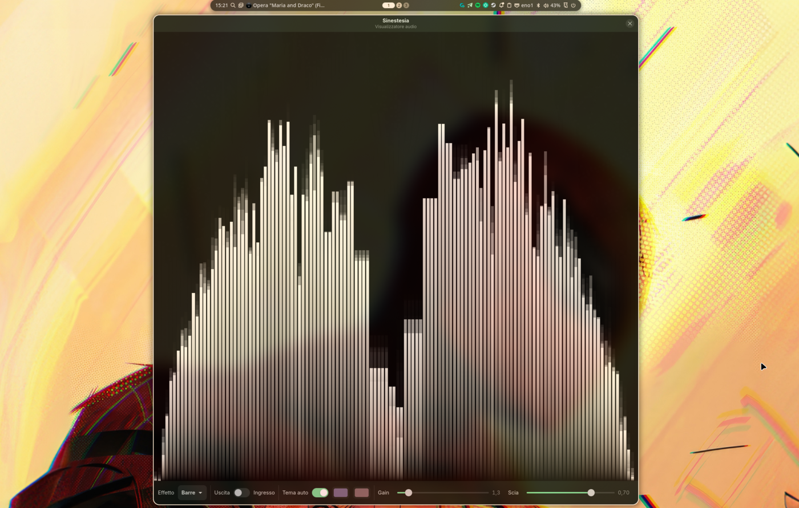
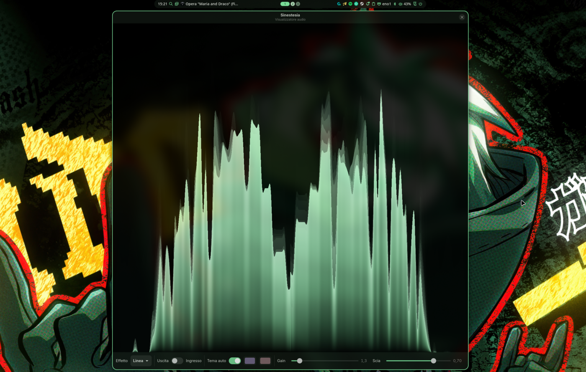
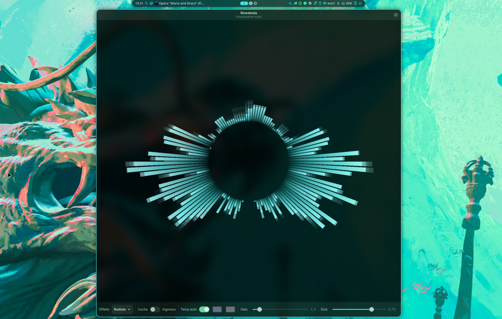
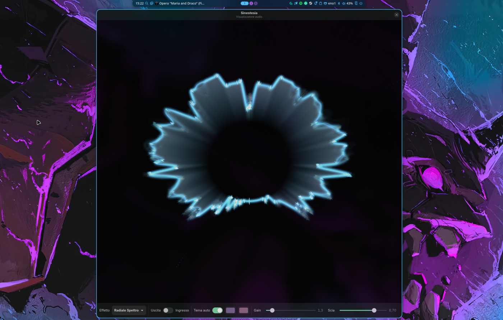
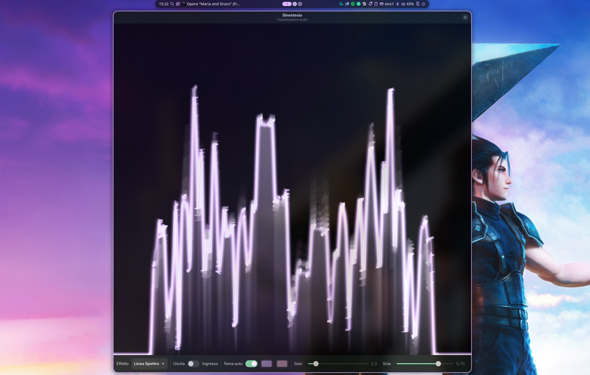

# Sinestesia

Visualizzatore audio per Linux scritto in **Rust** con **Relm4 / GTK4 + libadwaita**.
Cattura l'audio di sistema (output o input) via **PipeWire**, ne analizza lo spettro in
tempo reale (FFT) e lo rende con effetti fluidi su **OpenGL** (GtkGLArea).


## Screenshot

I cinque effetti, ciascuno con un tema (colori automatici) e uno sfondo diversi:

| Barre | Linea |
|:-:|:-:|
|  |  |
| **Radiale** | **Radiale Spettro** |
|  |  |

**Linea Spettro** — variante neon, bordo luminoso a visibilità proporzionale al volume:



## Caratteristiche

- **Effetti** selezionabili a runtime:
  - *Barre* (stile Cava)
  - *Linea* (curva dello spettro)
  - *Radiale* (spettro ad anello con particelle)
  - *Linea Spettro* e *Radiale Spettro* (varianti "neon": riempimento trasparente,
    bordo luminoso da 1px, bagliore; outline a visibilità proporzionale al volume)
  - *Tunnel* (anelli che congelano la sagoma dello spettro e sfrecciano verso
    l'osservatore avvitandosi, più campo di stelle; le basse frequenze
    accelerano corsa, vortice ed emissione — ottimo con la Scia alzata)
  - *Poliedro* (solido geodetico 3D con spigoli luminosi: la latitudine dà la
    frequenza e l'emisfero il canale, i bassi lo avvicinano alla camera e i
    transienti fanno esplodere le facce verso l'esterno)
  - *Imaging* (immagine stereo: disco visto dall'alto a 30°, ogni banda
    posizionata nella direzione da cui è percepita. L'azimut viene da ITD e
    ILD secondo la teoria duplex; su audio binaurale vero il fronte/retro è
    dedotto dall'ombra del padiglione (crollo dell'ILD a 4–6 kHz). Su
    materiale con semplice panning di ampiezza l'informazione fronte/retro
    non esiste e l'effetto resta sull'arco frontale invece di inventarla)
- **Layout speculare stereo**: centro = basse frequenze, bordi/lati = alte;
  metà sinistra = canale L, metà destra = canale R (in input: mirror mono).
- **Colori**: manuali (due color picker) o **automatici** dal tema di sistema
  (accent color di libadwaita, aggiornato live con matugen/noctalia).
- **Sorgente** audio commutabile tra uscita (monitor) e ingresso (microfono).
- **Gain** (moltiplicatore d'ampiezza) e **Scia** (motion blur) regolabili.
- **Modalità solo visualizzatore**: `F11` schermo intero senza barre, `H`
  nasconde/mostra header bar e pannello controlli restando in finestra, `Esc`
  ripristina tutto.
- Impostazioni persistenti in `~/.config/sinestesia/config.toml`.
- L'UI segue automaticamente il tema GTK di sistema (libadwaita).

## Requisiti

- Rust (edition 2021)
- PipeWire, GTK4, libadwaita, libepoxy (header di sviluppo)
- Un compositor con OpenGL/EGL (Wayland o X11)

## Build ed esecuzione

```sh
cargo run --release
```

## Installazione (menu applicazioni)

```sh
./install.sh
```

Installa il binario in `~/.local/bin`, la voce `.desktop` e l'icona in `~/.local/share`.

## Documentazione

Le specifiche complete sono in [`PRD.md`](PRD.md).

## Licenza

MIT
